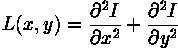
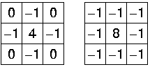
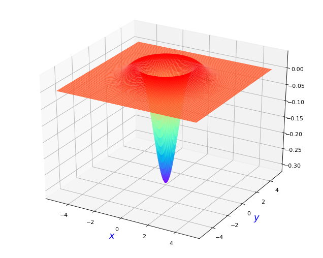
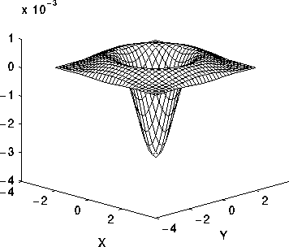
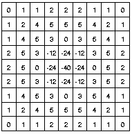

推荐文章:  [Laplacian/Laplacian of Gaussian][1]

LoG: Laplacian of Gaussian, 又称 Marr Filter

拉普拉斯是对图像的二阶空间导数的一个二维各向同性的测量。图像的拉普拉斯强调快速强度变化的区域，因此经常被用于边缘检测（见零交叉边缘检测器）。拉普拉斯常被应用于首先被近似高斯平滑滤波器平滑过的图像，以降低其对噪声的敏感性，因此这两个变体将在这里一起描述。该运算器通常将单一灰度图像作为输入，并产生另一个灰度图像作为输出。

Lapacian
表达式：

$$L(x,y)=\frac{\partial^2I}{\partial x^2}+\frac{\partial^2I}{\partial y^2}$$

[//]:#
两种常见的小尺寸拉普拉斯算子

图1

由于这些kernel是对图像进行二次导数测量的近似值，它们对噪声非常敏感。为了解决这个问题，在应用拉普拉斯滤波器之前，图像通常被高斯平滑处理。这个预处理步骤减少了微分步骤之前的高频噪声成分。

事实上，由于卷积操作是关联性的，我们可以首先将高斯平滑滤波器与拉普拉斯滤波器进行卷积，然后将这个混合滤波器与图像进行卷积以达到所需的结果。这样做有两个好处:

* 由于高斯和拉普拉斯的核通常比图像小得多，这种方法通常需要的算术运算要少得多。
* LoG（"高斯平滑的拉普拉斯算子"）核可以预先计算，因此在运行时只需要在图像上进行一次卷积。

以零为中心、具有高斯标准偏差$\sigma$的二维LoG函数形式：

$$LoG(x,y) = -\frac{1}{\pi \sigma^4}[1- \frac{x^2+y^2}{2\sigma^2}]e^{-\frac{x^2+y^2}{2\sigma^2}}$$
图示如下：
$\sigma=1$

[//]:#

$\sigma=1.4$时，离散核近似如下：

请注意，随着高斯变得越来越窄，LoG核变得与图1所示的简单拉普拉斯核相同。这是因为在离散的网格上用很窄的高斯（Eqn:eqnsigma < 0.5像素）进行平滑处理没有效果。因此，在离散的网格上，简单拉普拉斯可以被看作是窄高斯的LoG的一个极限情况。

[1]: https://homepages.inf.ed.ac.uk/rbf/HIPR2/log.htm